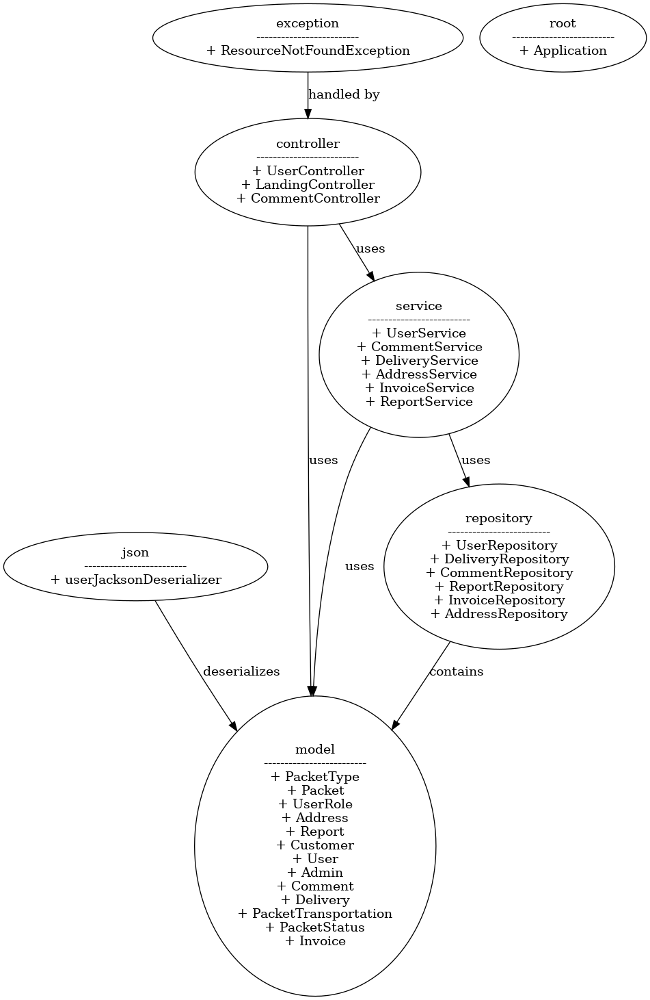
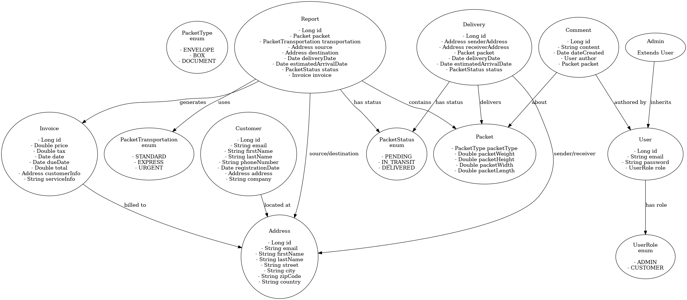

# Parcel Tracker System

This project is an application designed to manage deliveries and tracking efficiently. Built with a modern tech stack, this application provides users with a seamless experience for monitoring parcel status and managing delivery logistics.

## Tech Stack

| **Technology**                 | **Description**                                 |
|-------------------------------|-------------------------------------------------|
| Backend Framework             | Spring Boot 3.3.4                               |
| Programming Language          | Java 17                                       |
| Database                      | H2 (in-memory database)                        |
| Web Framework                 | Thymeleaf                                     |
| Security                      | Spring Security                                |
| ORM                           | Spring Data JPA                               |
| PDF Generation                | iText                                         |
| Dependency Management         | Maven                                         |
| Project Management            | Lombok (for boilerplate code reduction)       |

## Features

- User authentication and authorization using Spring Security.
- CRUD operations for parcel management.
- In-memory H2 database for easy testing and development.
- PDF generation for delivery documents using iText.
- Clean and responsive web interface using Thymeleaf.

## Getting Started

### Prerequisites

- JDK 17
- Apache Maven

### Installation

1. Clone the repository

2. Navigate to project directory

3. Build the project using the following command:

    ```bash
    mvn clean install
    ```

4. Run the application using the following command:

    ```bash
    mvn spring-boot:run
    ```

5. The application will start on port 9000. Open your browser and navigate to `http://localhost:9000` to access the application.

## Architecture

The following diagrama show the architecture of the application:



## Usage

- Register a new user or login with the default admin credentials:
  - **Username**: admin
  - **Password**: admin
- Sign up for a new account or log in to your existing account.
- Manage parcels by adding, editing, or deleting them.
- Track the status of your deliveries.
- Generate delivery documents in PDF format.

## Contributing

Contributions are welcome! Please follow these steps to contribute to the project:

1. Fork the repository

2. Create a new branch (`git checkout -b feature/feature-name`)

3. Make changes and commit them (`git commit -am 'Add new feature'`)

4. Push to the branch (`git push origin feature/feature-name`)

5. Create a new Pull Request

## License

This project is licensed under the MIT License - see the [LICENSE](LICENSE) file for details.
